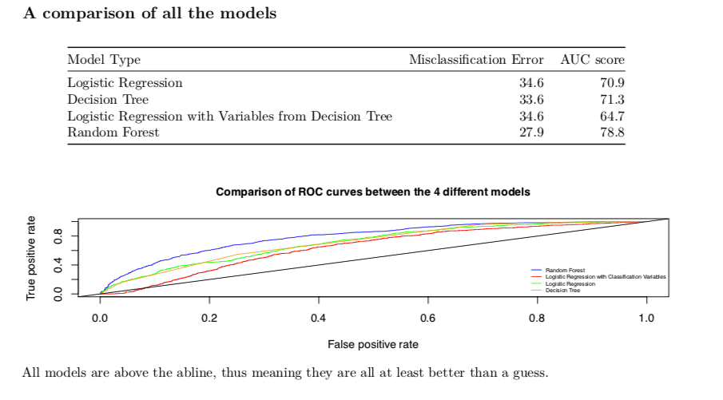

# Predicting the success of Mobile Applications in the Google Play Store

This project was developed by Dominic Teo, Grace Prakaisriroj and Alessandro Luciano as our capstone group project for the undergraduate final year Statistics course ST309. The more detailed report on the entire project can be found in the [pdf document](Final_report.pdf). Unfortunately, the **Rmarkdown file has been lost.** 

## Introduction

The global app economy is estimated to be worth 6.3 trillion USD by 2021, up from 1.3 trillion USD in 2018 (AppAnnie,2019). Over this period the user base will almost double from 3.4 billion people using apps to around 6.3 billion (AppAnnie, 2019).

This rapid market growth has produced no shortage of stories of individual app developers making great fortunes from their apps. However, the majority of developers are still struggling to break even (AppSurvey, 2013). For those unsuccessful app developers, a clear analysis of the characteristics of existing successful apps would provide a useful insight into creating apps that users want (Tian,2015). 

Therefore, the main goal of this project is to identify the characteristics that successful apps share and investigate which of these factors is important for success. This study is relevant for both developers and consumers, since both parties will benefit from a greater alignment of demand and supply in the app market; consumers will have a greater choice of apps they enjoy and developers will reap the financial gains of their work.

## Methodology

Our project has two research questions:
1. What characteristics do successful apps share?
2. What factors are important for app success on the Google Play Store?

We applied 3 different classification modeling approaches to the data in order to find significant variables in determining the success of mobile apps. 
1. Logistic Regression

2. Decision Trees and Pruned Decision Trees

3. Random Forest 

## Results and Conclusion 

From our study and use of the 4 different models, we can conclude that the random forest model is most effective in predicting the success of mobile applications. Our random forest model demonstrates that Price, Rating, DaysSinceLastup and Size are the most important variables used in the construction of the model.

This is important for developers who want to develop successful mobile applications. They should hence develop free applications with the aim of receiving high ratings in the Google Play Store. This could mean that developers trying to make money from their apps could stand to make their apps free but concentrate on in-app monetization opportunities instead. Making consumers pay for the app itself seems to be a major deterrent for users to download the app.

More interestingly, developers should also continuously and consistently update the app as we found that apps that were more recently updated tend to be more successful. We also found that overall, apps that were larger in size were more successful (although less significant than the other three variables). We think that size could be a good proxy for complexity and sophistication, hence apps that are more complex and developed tend to be more popular.

